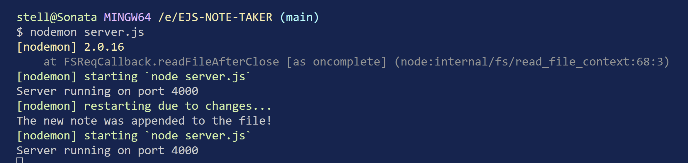
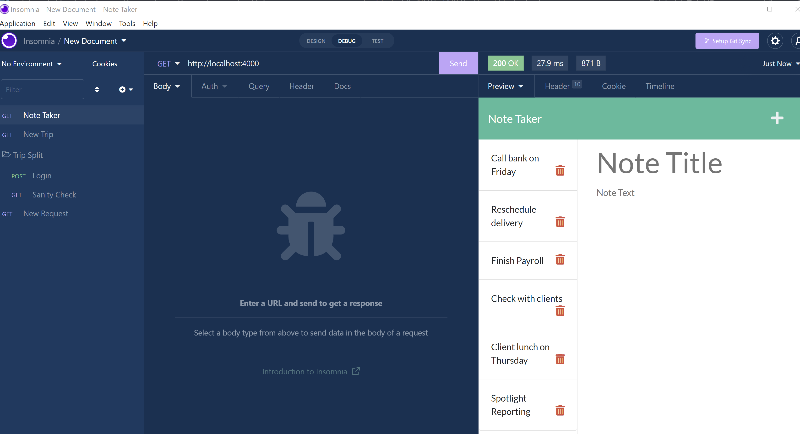
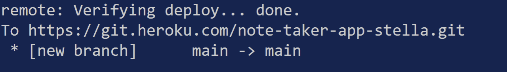
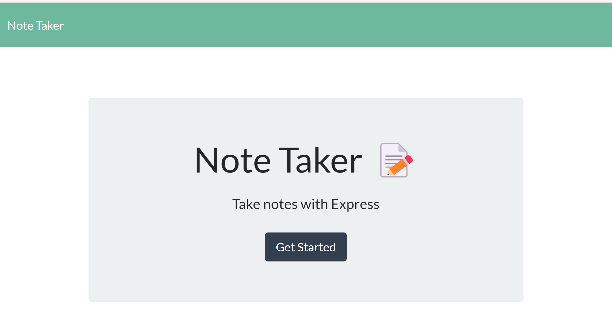
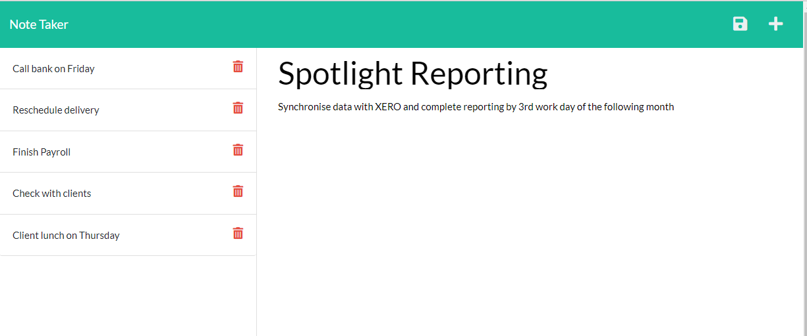
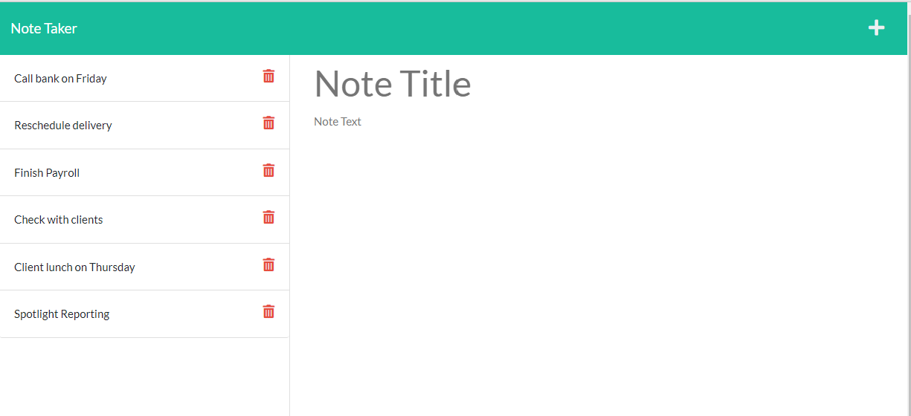
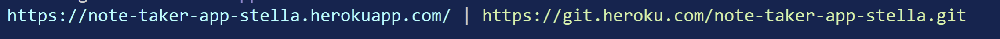

# Express.js: Note Taker

[](https://opensource.org/licenses/MIT)


## Table of Contents
* [Description](#description)
* [Installation](#installation)
* [Usage](#usage)
* [Deployment](#deployment)
* [References](#references)
* [License](#license)

## Description

This note taker application can be used to write and save notes, allowing the user to better organize their thoughts and keep track of the important tasks they need to complete.  This application will use an Express.js back end and will save and retrieve note data from a JSON file. 

   * <strong><em>User Story</em></strong>
```
AS A small business owner
I WANT to be able to write and save notes
SO THAT I can organize my thoughts and keep track of tasks I need to complete
```
   * <strong><em>Acceptance Criteria</em></strong>
```
GIVEN a note-taking application
WHEN I open the Note Taker
THEN I am presented with a landing page with a link to a notes page
WHEN I click on the link to the notes page
THEN I am presented with a page with existing notes listed in the left-hand column, plus empty fields to enter a new note title and the note’s text in the right-hand column
WHEN I enter a new note title and the note’s text
THEN a Save icon appears in the navigation at the top of the page
WHEN I click on the Save icon
THEN the new note I have entered is saved and appears in the left-hand column with the other existing notes
WHEN I click on an existing note in the list in the left-hand column
THEN that note appears in the right-hand column
WHEN I click on the Write icon in the navigation at the top of the page
THEN I am presented with empty fields to enter a new note title and the note’s text in the right-hand column
```
   
## Installation

1. Node.js is installed from the website, https://www.nodejs.org. 

2. Node Package Manager (npm) is a software manager and installer which puts the modules in 
   place so that the node project can utilize it, and also, it manages dependency conflicts intelligently.

3. The application is initialized using <strong>npm init</strong>.
                 
4. During the installation process, the user will be asked to input some information about the 
   project.  The package.json will be generated in our folder after initialization of npm.  This package.json file contains all the details of the application in which the user have inputted during the npm initialization.

5. This application requires the installation of express framework which is done by this  
   command prompt at the system terminal, <strong>npm install express --save</strong> or <strong> npm i express </strong>.  The application will not work without this installation.   

6. Body-Parser installation is installed by using <strong>npm install body-parser -- save
   </strong>at the system terminal. Body-Parser is node.js middleware at parses incoming/user request bodies in a middleware before the handlers.        

7. Nodemon is installed as development dependency meaning that if our application 
   ever goes in production, this package will not be included.  The command to install nodemon for this case is <strong>npm i -D nodemon</strong>.
 
   The purpose of this package is to watch for any changes in our files and restart the server instead of us having to do that manually ourselves.  The screenshot show the working of the nodemon.
  
        

8. For this application, I have used Insomnia for testing the application.

   The installation link is as as follows as provided by the instructor:-

      [Insomnia.rest](https://insomnia.rest/download)
 
   The screenshot is provided to show the testing using Insomnia.

       

9.  Heroku is installed for the application to be deployed to Heroku. 

      

## Usage

The steps to use this application is to click on the Heroku link which is will bring on the website where the codes are modified to make the application works according to the acceptance criteria, that is building the back end to connect the front end and deploying the entire application to Heroku.

   [Heroku - Express.js Note Taker Application](https://note-taker-app-stella.herokuapp.com/)
 
   -  This will bring on the landing page with a link to a notes page:-

   

   -  Click on the "Get Started" will bring on the Notes page:-

   

   -  Further steps on the usage of the application:-

   

   -  Fill in your note in the "new title"/"new note" fields and hit the save icon on the top right corner. All saved notes will be rendered on the left hand side and can either be viewed or deleted. 

   

   -  To view a note, click on the title of the note and the entire note will be rendered on the right side. Notes being viewed will be read only and cannot be edited. If while viewing a saved note, you decide to create a new note, click on the pencil icon on the top right corner to start a new note. To delete a note simply click the trash can button. Click on the note taker logo to go back to the home page.


   -  LOCAL HOST & CLI(use for local testing): In order to test this application, I will cd into the note-taker respository via the CLI. Once there, type in 'nodemon server.js' to initialize the server. Go to your browser and type in localhost:4001, to view html files. Once here, the application can be used in the same way as the link to Heroku deployment.

## Deployment

The application has been deployed to Heroku and the link to Heroku:-

 * [Heroku - Note Taker](https://note-taker-app-stella.herokuapp.com/)

 * 

The URL of the GitHub respository is https://github.com/stellalph/EJS-NOTE-TAKER.git and the repository name of the project is EJS-NOTE-TAKER.


## License
  
This project is licensed under the terms of the MIT license.

## References
* [How to Setup an Express Server](https://medium.com/@ralph1786/how-to-setup-an-express-server-5fd9cd9ae073)
* [Insomnia Docs](https://docs.insomnia.rest/insomnia/get-started)
* The Full-Stack Blog - How to install the Heroku CLI
* The Full-Stack Blog - Heroku Deployment Guide